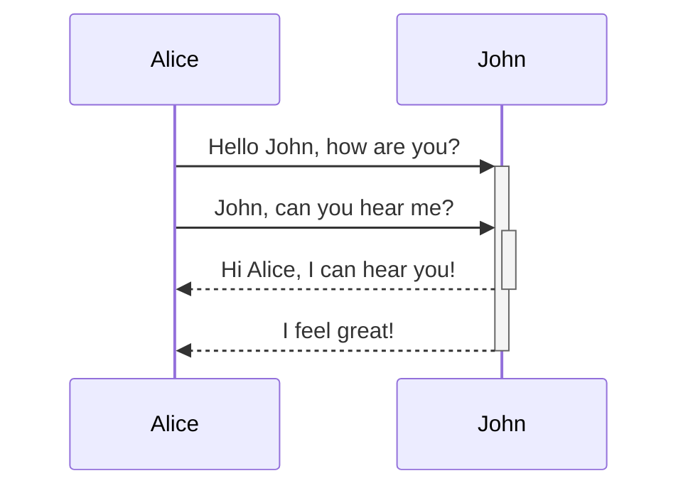

<!-- NOTE-swimm-snippet: the lines below link your snippet to Swimm -->
### 📄 inpaintGAN/main.py
```python
5      if __name__ == '__main__':
6          inpaintConfig = Config()
7      
8          inpaintGAN = InpaintGAN(inpaintConfig)
9          inpaintGAN.train()
```

<br/>

<!--MERMAID {width:100}-->

<!--MCONTENT {content: "sequenceDiagram<br/>\nAlice->>+John: Hello John, how are you?<br/>\nAlice->>+John: John, can you hear me?<br/>\nJohn\\-\\-\\>>-Alice: Hi Alice, I can hear you!<br/>\nJohn\\-\\-\\>>-Alice: I feel great!<br/>\n\n<br/>"} --->

<br/>

This file was generated by Swimm. [Click here to view it in the app](https://app.swimm.io/repos/Z2l0aHViJTNBJTNBSW5wYWludEdBTiUzQSUzQU1vc2hQZQ==/docs/00xa1xe1).
